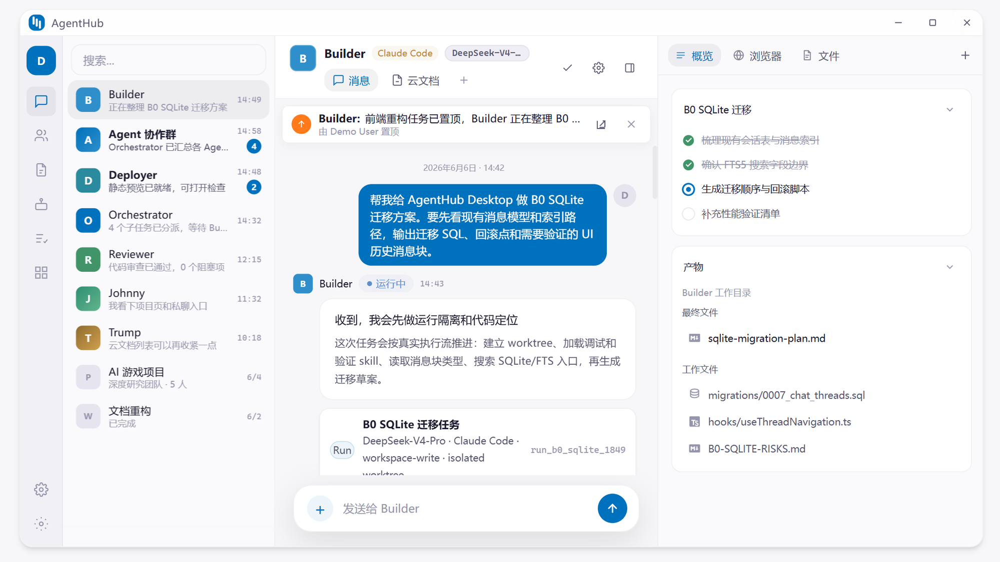

<div align="center">
  

  # AgentHub

  把 AI Agent 当队友一样拉进群聊。和真人好友、AI Builder、AI Reviewer 在同一个 IM 里聊天协作——消息就是任务流，聊天就是工作台。

  [English](README_EN.md) · [官网](https://hub.vectorcontrol.tech) · [文档](https://hub.vectorcontrol.tech/docs) · [API](api/)

  [](https://github.com/TokenDanceLab/AgentHub/actions/workflows/checks.yml)
  [](https://github.com/TokenDanceLab/AgentHub/releases)
  
  
  
  [](https://github.com/TokenDanceLab/AgentHub/blob/master/LICENSE)
</div>

<div align="center">
  
</div>

## 产品定位

AgentHub 让你像在 IM 群聊里协作一样，把真人好友、Builder、Reviewer、Researcher、Deployer 等 AI Agent 放进同一个项目会话，围绕代码、文档、Diff、Preview、Approval 和产物协同工作。

## 核心特性

- **IM 形态协作** — 单聊、群聊、@Agent，在同一条任务流里完成
- **多 Runtime 调度** — Claude Code、Codex、OpenCode 通过统一 Adapter 接入
- **Diff / Preview / Approval** — 代码变更内联展示，审批流可控
- **三端原生** — Tauri Desktop + Web + Expo React Native Mobile（Desktop/Web 主线；Mobile 是装配中的 fixture/边界验证 lane，**非 release candidate** —— 发布链路的 `build-mobile` 受 `RELEASE_MOBILE_ENABLED` 门控、默认关闭）
- **Hub-Edge 分布式** — 本地执行不依赖 Hub；Hub 提供多端同步、远程查看和审计

## 技术栈

| 层 | 技术 |
|---|---|
| Desktop | Tauri 2 · React 19 · TypeScript · Vite |
| Web | React 19 · TypeScript · Vite |
| Mobile | React Native · Expo |
| 后端 | Go · PostgreSQL · Redis · SQLite |

## 仓库结构

| 目录 | 说明 |
|---|---|
| `app/web` | 浏览器工作台 |
| `app/desktop` | Tauri Desktop 工作台 |
| `app/mobile-rn` | Expo / React Native Mobile |
| `app/shared` | 共享 UI 组件、类型、transcript 逻辑 |
| `app/workbench` | 端级工作台壳（`@agenthub/workbench`，依赖方向 workbench → shared 单向） |
| `hub-server` | Hub API：身份、会话、项目、任务、消息、审批 |
| `edge-server` | 本地执行节点：CLI Adapter、SQLite、事件回放 |
| `pkg` | Hub/Edge 共享的 Go 包（errcode、jwtutil、logmask、testkit 等；独立 module，经根 `go.work` 联编） |
| `api` | OpenAPI 与 WebSocket 事件合同 |
| `docs` | 架构、治理与设计文档（进度与路线图在 GitHub issues，不在 `docs/`） |

## 快速开始

最小本地启动路径（5 步）。需要 OpenSSL、Docker、Go 1.26+、Node 22+/corepack、pnpm 10+。

```bash
cp .env.example .env && secret="$(openssl rand -hex 32)" && sed -i.bak "s/^AGENTHUB_JWT_SECRET=.*/AGENTHUB_JWT_SECRET=$secret/" .env && rm -f .env.bak && export AGENTHUB_JWT_SECRET="$secret" && unset secret  # 1. 复制配置并生成随机开发 secret
docker compose up -d postgres redis         # 2. 起基础设施（PG16 + Redis7，仅绑 127.0.0.1）
cd hub-server && go run ./cmd/server-hub    # 3. 起 Hub Server（自动跑迁移，API 在 :8080）
cd ../app && corepack pnpm install          # 4. 装前端依赖
corepack pnpm dev                           # 5. 起 Desktop Vite（:5173）；web 用 corepack pnpm dev:web
```

`.env.example` 不提供可复用 JWT secret；Windows PowerShell 命令、完整启动路径、OIDC 接入和 Edge Server 调试见 [docs/developer-quickstart.md](docs/developer-quickstart.md)。生产部署与必填变量见 [docs/architecture/05-deployment.md](docs/architecture/05-deployment.md)。

## 开发

| 入口 | 说明 |
|---|---|
| [docs/developer-quickstart.md](docs/developer-quickstart.md) | 本地最短启动路径 |
| [docs/architecture.md](docs/architecture.md) | 架构总览与模块索引 |
| [docs/README.md](docs/README.md) | 文档导航 |
| [AGENTS.md](AGENTS.md) | 项目规则 SSOT（分支、红线、证据等级） |

## 仓库内容边界

本仓库是 **public** 的，只包含：

- 全部源代码、API 契约（`api/`）、工程门禁脚本（`scripts/verify/`）
- 面向用户与贡献者的公开文档（`docs/` 中不含内部运营/安全材料）
- 安全策略摘要（`SECURITY.md`，含发布门禁风险状态表）

**不在本仓库**（属 TokenDance 私有文档中枢 `TokenDanceLab/docs`，private）：

- 内部治理执行映射（TokenDance 队列、飞书集成、发布审批切片）
- 安全风险登记表正文与威胁模型（本仓只保留无细节的发布门禁状态）
- 私有部署拓扑、运维证据与路由

公开文档不包含真实服务器地址、生产 secret、token、日志或个人路径（见 `AGENTS.md` 的“安全和隐私”）。治理公开区说明见 [docs/governance/README.md](docs/governance/README.md)。

## 贡献

欢迎提交 Issue 和 Pull Request。详情见 [CONTRIBUTING.md](CONTRIBUTING.md)。

## License

Apache-2.0. See [LICENSE](LICENSE).
