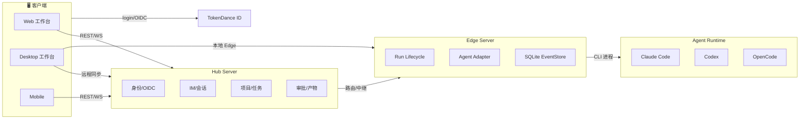

<div align="center">
  

  # AgentHub

  面向 AI Agent 团队协作的开源工作台。Web、Desktop、Mobile 三端原生，Hub-Edge 分布式架构，多 Runtime 统一调度。

  [English](README_EN.md) · [官网](https://hub.vectorcontrol.tech) · [文档](https://hub.vectorcontrol.tech/docs) · [API](api/)

  
  
  
  
  
</div>

<div align="center">
  
</div>

## 产品定位

AgentHub 让你像在 IM 群聊里协作一样，把 Builder、Reviewer、Researcher、Deployer 等 AI Agent 放进同一个项目会话，围绕代码、文档、Diff、Preview、Approval 和产物协同工作。



## 核心特性

- **IM 形态协作** — 单聊、群聊、@Agent、Orchestrator 分派，在同一条任务流里完成
- **多 Runtime 调度** — Claude Code、Codex、OpenCode 通过统一 Adapter 接入
- **Diff / Preview / Approval** — 代码变更内联展示，审批流与安全边界
- **三端原生** — Tauri Desktop + Web + Expo React Native Mobile
- **Hub-Edge 分布式** — 本地执行不依赖 Hub；Hub 提供多端同步、远程查看和审计
- **Glass 拟态设计** — OKLCH 设计 token、CSS Modules、共享 UI 组件库

## 技术栈

| 层 | 技术 |
|---|---|
| 前端 | React 19 · TypeScript · Vite · CSS Modules · Tauri 2 |
| 后端 | Go 1.25+ · PostgreSQL · Redis · SQLite (Edge) |
| 认证 | TokenDance ID · OIDC PKCE · JWT |
| 部署 | Docker Compose · Nginx · GitHub Actions |

## 快速开始

### 环境

- Go 1.25+
- Node.js 20+
- pnpm / Corepack

### 安装

```bash
git clone https://github.com/TokenDanceLab/AgentHub.git
cd AgentHub
corepack enable
corepack pnpm install --dir app --frozen-lockfile
```

### 启动 Hub Server

```bash
cd hub-server
go run ./cmd/server-hub
```

### 启动 Web 工作台

```bash
cd app
corepack pnpm --filter agenthub-web dev
```

### 启动 Desktop

```bash
cd app
corepack pnpm --filter agenthub-desktop dev
```

## 仓库结构

| 目录 | 说明 |
|---|---|
| `app/web` | 浏览器工作台 |
| `app/desktop` | Tauri Desktop 工作台 |
| `app/mobile-rn` | Expo / React Native Mobile |
| `app/shared` | 共享 UI 组件、类型、transcript 逻辑 |
| `hub-server` | Hub API：身份、会话、项目、任务、消息、审批 |
| `edge-server` | 本地执行节点：CLI Adapter、SQLite、事件回放 |
| `api` | OpenAPI 与 WebSocket 事件合同 |
| `docs` | 架构、路线图、设计文档 |

## 文档

| 内容 | 链接 |
|---|---|
| 产品文档 | [hub.vectorcontrol.tech/docs](https://hub.vectorcontrol.tech/docs) |
| 架构设计 | [docs/architecture.md](docs/architecture.md) |
| API 合同 | [api/](api/) |
| 路线图 | [docs/roadmap.md](docs/roadmap.md) |
| 设计系统 | [docs/design/](docs/design/) |
| 安全 | [docs/governance/security-risk-register.md](docs/governance/security-risk-register.md) |

## 贡献

欢迎提交 Issue 和 Pull Request。详情见 [CONTRIBUTING.md](CONTRIBUTING.md)。

## License

Apache-2.0. See [LICENSE](LICENSE).
