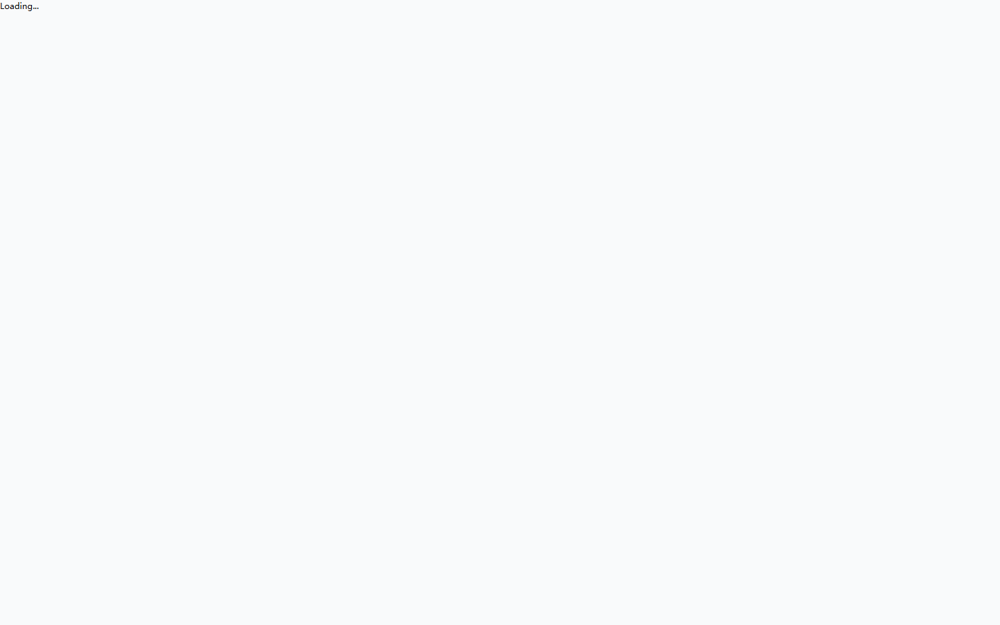

<div align="center">

# AgentHub / AI Workbench

> Claude Code, Codex, OpenCode — collaborating in one IM workspace

[](https://github.com/TokenDanceLab/AgentHub)
[](https://go.dev/)
[](https://react.dev/)
[](LICENSE)

[中文文档](README.md) &nbsp;·&nbsp; [Get Started](docs/getting-started/GOAL.md) &nbsp;·&nbsp; [Website](https://hub.vectorcontrol.tech)

</div>

<br>

<!-- Screenshot placeholder: Desktop main UI dark theme -->
<p align="center">
  
</p>

---

## Unified Runtime Scheduling · IM-native Multi-Agent Collaboration · Team Approval Pipelines · Bilingual zh/en · Glassmorphism Design

<br>

## Key Features

| | |
|---|---|
| **Unified Runtimes** | Schedule Claude Code, Codex, and OpenCode from the same UI — never locked into one toolchain |
| **IM-native Collaboration** | Create groups, @mention agents, approve diffs — just like Slack or WeChat, not another IDE plugin |
| **Hub-Edge Distributed** | Local execution + cloud sync + multi-device — your data stays local, collaboration goes through the cloud |

<br>

## Quick Start (5 steps)

```powershell
# 1. Clone
git clone https://github.com/TokenDanceLab/AgentHub.git
cd AgentHub

# 2. Initialize
.\scripts\setup.ps1

# 3. Start Edge Server (pick a runtime)
cd edge-server
go run ./cmd/agenthub-edge --addr 127.0.0.1:3210 --runner-profile claude-code

# 4. Start Desktop
cd ..\app\desktop
pnpm install
pnpm dev

# 5. Open http://localhost:5173
```

> Requires Go 1.25+, Node.js 20+, and pnpm. See [Get Started](docs/getting-started/GOAL.md) for details.

<br>

## Feature Comparison

| Capability | AgentHub | Cursor | Windsurf | Claude Code | Codex |
|------|:---:|:---:|:---:|:---:|:---:|
| Multi-agent Collaboration | **IM group chat** | Solo | Solo | Experimental | Solo |
| Multi-runtime Support | **3 runtimes** | Proprietary | Proprietary | Claude only | OpenAI only |
| Bilingual zh/en | **Full** | EN | EN | EN | EN |
| Local Execution | **Tauri desktop** | VS Code ext | VS Code ext | CLI | CLI |
| Mobile | **Android native** | None | None | None | Web |
| Team Approval Pipeline | **Built-in** | None | None | Permission modal | None |
| Multi-device Sync | **Hub cloud** | None | None | None | None |
| Design System | **Glassmorphism** | VS Code theme | VS Code theme | TUI | Web Dashboard |
| MCP Ecosystem | Planned | Full | Full | Best-in-class | None |
| Pricing | **Free & OSS** | $20/mo | $20/mo | API metered | $20/mo |

> AgentHub innovates at the IM layer — it doesn't replace any runtime, it lets them collaborate in one workspace.

<br>

## Architecture

```text
Desktop / Mobile / Web
        |
   Edge Server (Go) ── Agent Runtime Adapter ── Claude Code / Codex / OpenCode
        |
   Hub Server (Go) ── PostgreSQL + Redis
```

| Component | Responsibility |
|------|------|
| **Desktop App** (Tauri) | Local execution workspace, IM chat, diff approval, multi-agent management |
| **Web App** | Browser workspace for remote viewing, approval, and collaboration |
| **Mobile App** (Tauri Android) | Mobile IM, approvals, previews |
| **Edge Server** | Local execution node, Agent CLI process management, EventStore |
| **Hub Server** | Accounts, IM groups, multi-device sync, device routing, audit |
| **Agent Runtime** | Claude Code / Codex / OpenCode CLI adapters |

Local execution works without Hub — Desktop only needs Local Edge for the full project→thread→run workflow. Hub provides cloud IM, multi-device sync, and remote approval.

<br>

## Product Layers

| Layer | Description | Phase |
|---|------|:---:|
| **Desktop Command Center** | Local projects, threads, runs, diffs, approvals, previews | P0 ✅ |
| **IM Collaboration** | Direct chat, groups, @Agent, multi-agent review, progress cards | P1 🔧 |
| **Hub Network** | Accounts, friends, multi-device sync, Edge relay, audit | P2-P4 📋 |

<br>

## Tech Stack

| Layer | Technology |
|---|------|
| Frontend | React 19 + TypeScript + Vite + CSS Modules + OKLCH tokens |
| Desktop | Tauri 2.5 |
| Mobile | Tauri 2.5 (Android) |
| Edge Server | Go 1.25 + WebSocket + Agent Runtime adapters |
| Hub Server | Go 1.25 + Gin + GORM + PostgreSQL + Redis |
| Realtime | WebSocket typed events |
| Shared UI | `@shared/ui` — reusable UI component library |

<br>

## Project Structure

```text
AgentHub/
├── app/
│   ├── desktop/          # Tauri desktop app
│   ├── web/              # Web workspace
│   ├── mobile/           # Mobile app
│   └── shared/           # Shared types, API client, @shared/ui
├── edge-server/          # Edge execution node
├── hub-server/           # Hub central service
├── api/                  # API contracts (OpenAPI + WebSocket events)
├── docs/                 # Documentation
│   ├── getting-started/  # Quick start guide
│   ├── tutorials/        # Roadmaps and learning paths
│   ├── architecture/     # Product requirements, system architecture, implementation guide, design docs, ADR
│   ├── governance/       # Security risk register, branch governance, doc standards
│   ├── development/      # Project status and handoff
│   ├── archive/          # Historical reviews and archived documents
│   ├── reference/        # Research and competitive analysis
│   ├── operations/       # Desktop QA SOP, operations
└── scripts/              # Setup scripts, git hooks
```

<br>

## Documentation

| Document | Audience |
|------|------|
| [Get Started](docs/getting-started/GOAL.md) | New users and FAQ |
| [Product Requirements](docs/architecture/system-design/product-requirements.md) | Product positioning and phase goals |
| [System Architecture](docs/architecture/system-design/system-architecture.md) | Technical architecture and core concepts |
| [API Contract](api/) | REST + WebSocket interface definitions |
| [Security Risk Register](docs/governance/security-risk-register.md) | Security risk tracking |

<br>

## Auth

Local execution works without login. TokenDance ID unified login is required for cloud IM, multi-device sync, and remote control.

<br>

---

<p align="center">
  <a href="README.md">中文文档</a> &nbsp;·&nbsp;
  <a href="docs/getting-started/GOAL.md">Get Started</a> &nbsp;·&nbsp;
  <a href="docs/architecture/system-design/system-architecture.md">Architecture</a> &nbsp;·&nbsp;
  <a href="api/">API</a>
</p>
