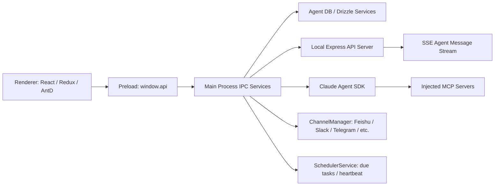

# Cherry Studio 参考项目概览

> 分析日期：2026-05-26
> 源码快照：`reference/cherry-studio/`
> 上游：`https://github.com/CherryHQ/cherry-studio`
> 版本：`9b1a65829f547ce29a9f68c93112b47f4a2d2629`
> 调研快照提交标题：`fix(aiCore): do not treat Gemini model via non-Gemini provider as native PDF (#14329)`

---

## 结论

Cherry Studio 对 AgentHub 最有价值的不是单个视觉组件，而是一个成熟 AI Desktop 的整体组合：双模式 Shell、属性驱动主题、密集 Settings、Provider/Model 管理、typed message blocks、Claude Code SDK 集成、本地 API/SSE、任务调度、IM channel adapter。

可采纳方向：

| 优先级 | 可采纳内容 | AgentHub 落点 |
|---|---|---|
| P0 | typed message block、tool group、approval waiting 状态 | 两个 Home、Run/Session 日志、Human handoff |
| P0 | Settings shell + shared row/group primitives | Settings、Provider/Profile/Target、TokenDance ID 连接状态 |
| P0 | SDK env blocklist、permission hook、SSE abort/timeout | Codex/Claude Code/OpenCode adapter、Edge Server stream |
| P1 | attribute-driven shell/theming | Desktop/Web shell、Design Contract token 映射 |
| P1 | Provider/model/key health UI | Profile、model route、Relay/Agent provider 管理 |
| P1 | task scheduler + channel lifecycle | Automation、IM gateway、Feishu/Lark 集成 |
| P2 | local API server shape、Electron E2E fixtures | Desktop packaging、API debug surface |

必须规避的方向：

- Cherry 是本地单用户 Electron app；AgentHub 是 Hub/Edge/Web/Desktop 多端系统，状态权威不能放在 renderer。
- Cherry 的 renderer/main/API server 有部分本地捷径，例如 main process 读取 renderer Redux；AgentHub 不能复制这个边界。
- Provider secret、workspace path、raw env var 不应进入公开 UI 或公开文档；AgentHub 要保留 TokenDance ID OIDC、产品本地授权、Edge 侧执行边界。

---

## 技术栈

| 层 | Cherry Studio | 证据 |
|---|---|---|
| Desktop shell | Electron 41 | `package.json:315` |
| Frontend | React 19, Ant Design, styled-components, Tailwind v4, lucide-react | `package.json:284`, `package.json:361`, `package.json:387`, `package.json:422`, `package.json:426` |
| State/data | Redux Toolkit, redux-persist, React Query, SWR, Dexie IndexedDB | `package.json:204`, `package.json:209`, `package.json:402`, `package.json:424`; `src/renderer/src/databases/index.ts` |
| Model/provider | Vercel AI SDK provider packages | `package.json:116-134` |
| Agent runtime | `@anthropic-ai/claude-agent-sdk` | `package.json:87`; `src/main/services/agents/services/claudecode/index.ts` |
| Agent DB | Drizzle + local SQLite/libSQL style service layout | `src/main/services/agents/README.md`; `src/main/services/agents/database/schema/agents.schema.ts` |
| E2E | Playwright Electron fixture | `tests/e2e/fixtures/electron.fixture.ts` |

---

## 架构形态

源码入口：

- App provider spine：`src/renderer/src/App.tsx:33-43`
- 双 Shell：`src/renderer/src/Router.tsx:60-74`
- 左侧 icon rail：`src/renderer/src/components/app/Sidebar.tsx`
- 顶部 tab shell：`src/renderer/src/components/Tab/TabContainer.tsx`
- 主题属性：`src/renderer/src/context/ThemeProvider.tsx:54-62`
- Ant Design token：`src/renderer/src/context/AntdProvider.tsx:28-116`
- Local API routes：`src/main/apiServer/app.ts:150-166`
- Agent API client：`src/renderer/src/api/agent.ts:70-124`
- Agent stream SSE：`src/main/apiServer/routes/agents/handlers/messages.ts:45-257`

---

## AgentHub 对照

| Cherry Studio 设计 | AgentHub 应用 | 处理方式 |
|---|---|---|
| assistant/topic/model | workspace/session/run/agent/handoff | 只借鉴交互模型，不复制命名 |
| `askId` grouping | 多 Agent 对同一用户意图的并列结果 | 改成 intent/run-group 语义 |
| message block lifecycle | run event / tool event / artifact event | Edge/Hub 生成权威事件，前端只缓存 |
| local API server | Desktop debug surface / local bridge | 不做多端 SSOT |
| provider list/key popup | Provider profile / model route / Relay profile | secret 写入 OS store 或服务端安全存储 |
| Claude SDK service | Claude Code adapter 参考 | 抽象到 Codex/Claude Code/OpenCode adapter 边界 |
| Feishu adapter | AgentHub Feishu ingress/channel | 保留 TokenDance ID 统一登录，不让 Feishu 成为第二套登录 |
| memory MCP | RAG/memory 接入点 | AgentHub 应转成 Hub-owned memory + pgvector/审计策略 |

---

## 研究目录

- `02-ui-and-source-patterns.md`：Shell、主题、消息、Settings、QA 的源码级 UI 复用点。
- `03-agent-runtime-lessons.md`：Claude Code SDK、IPC/API/SSE、Scheduler、Channel、Provider/Model、RAG/memory 的 runtime 经验。
