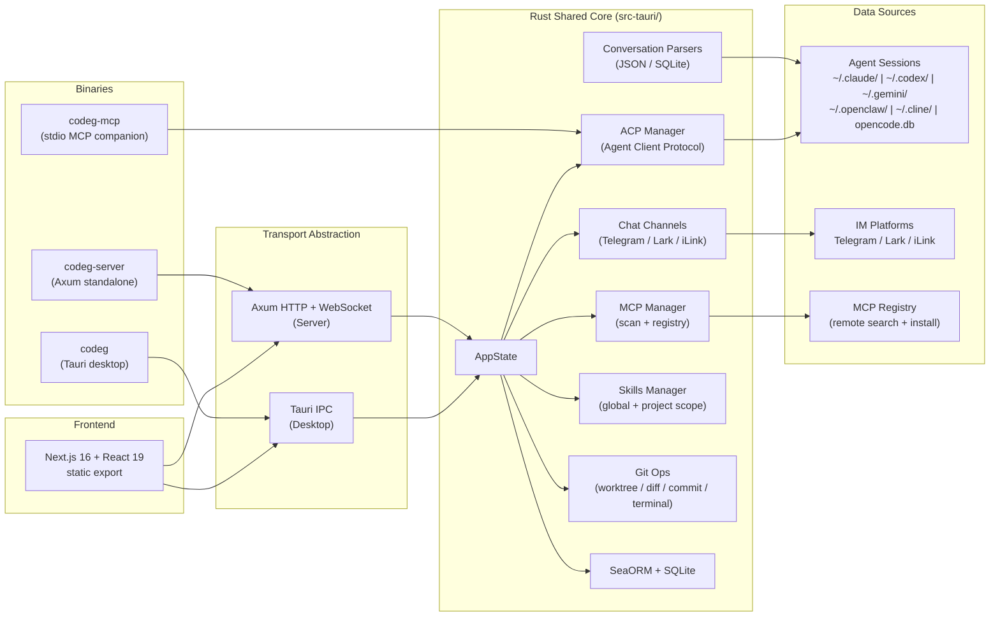

# Codeg 参考项目概览

> 分析日期：2026-05-26
> 上游：`https://github.com/xintaofei/codeg`
> License: Apache-2.0

---

## 结论

Codeg 是一个多 Agent AI 编码工作区聚合器（Multi-Agent AI Coding Workspace）。它把多个 AI 编码 agent（Claude Code、Codex CLI、OpenCode、Gemini CLI、OpenClaw、Cline）的会话整合进统一界面，支持桌面端（Tauri）和 Web 服务端（Docker）双模式部署。

它本质上是一个 "meta-IDE for AI coding tools"：不替代单个 agent，而是在其之上提供统一的会话管理、跨 agent 协作、项目脚手架和 IM 通道。

对 AgentHub 最有价值的是三个设计：

1. **多 agent 会话聚合**：通过解析各 agent 的本地会话文件（JSON/SQLite），在一个工作区中统一展示对话历史。直接读取 `~/.claude/projects`、`~/.codex/sessions`、`~/.gemini` 等路径，不依赖 agent 自身 API。
2. **ACP 委派协作**：通过 `codeg-mcp` companion binary 暴露 `delegate_to_agent` tool，主 agent 可向不同类型的 sub-agent 委派任务，每个 sub-agent 运行在独立 session 中。
3. **Chat Channel 集成**：内置 Telegram、Lark（飞书）、iLink（微信）消息通道，支持实时通知和远程任务控制。

可采纳方向：

| 优先级 | 可采纳内容 | AgentHub 落点 |
|---|---|---|
| P0 | 多 agent 会话聚合（解析本地 session 文件/DB） | Session/Workspace 历史统一视图，adapter 层 |
| P0 | ACP delegate_to_agent 委派模式（主 agent → sub-agent） | Multi-Agent 编排、agent handoff、run-group 调度 |
| P1 | Chat Channel adapter 抽象（Telegram/Lark/iLink） | IM gateway、Feishu/Lark ingress、消息路由 |
| P1 | Skills + MCP 双重管理（本地扫描 + registry 搜索 + install） | Skills registry、MCP marketplace 交互模型 |
| P2 | Transport abstraction（Tauri IPC vs Axum HTTP/WebSocket 共用 Rust core） | Desktop/Web 适配层架构参考 |
| P2 | git worktree 并行开发流程（create/switch/cleanup） | Worktree/diff 功能，多分支并行 agent session |
| P2 | Project Boot 可视化脚手架（shadcn/ui templates, live preview） | AgentHub project wizard / quick-start 体验 |

必须规避的方向：

- codeg 是**会话聚合器**而非 agent 运行时。AgentHub 的核心是自建 agent runtime（spawn/monitor/kill/health），不能简单复制其"只读聚合"模式。
- codeg 的 ACP 是轻量透传协议（MCP tool 包装），AgentHub 需要更完整的 agent 生命周期管理和状态机。
- codeg 是本地单用户工具，状态 SSOT 在本地 SQLite。AgentHub 是多端系统（Hub/Edge/Web/Desktop），状态权威必须在服务端。
- codeg 的 Chat Channel 直接绑定第三方登录。AgentHub 应保持 TokenDance ID 统一登录，不让第三方 IM 成为独立认证入口。

---

## 项目定位

| 维度 | Codeg | AgentHub |
|---|---|---|
| 产品形态 | Desktop app + Web server (Docker) | Hub / Edge / Web / Desktop 多端平台 |
| 核心定位 | AI coding tool 聚合器 + 协作工作区 | Agent 平台 + 运行时 + 协作 Hub |
| Agent 角色 | 聚合第三方 agent 会话，主 agent 委派 sub-agent | 自建 agent runtime，管理完整生命周期 |
| 用户数 | 本地单用户 | 多用户、多租户 |
| 状态权威 | 本地 SQLite | 服务端 PostgreSQL |
| Agent 集成 | 文件系统解析（只读） | API/协议层集成（读写控制） |
| IM 通道 | Telegram / Lark / iLink adapter | IM gateway + TokenDance ID 统一认证 |
| 部署 | Tauri desktop / Docker / 源码编译 | 云端 Hub / Edge Server / Desktop shell / Web |

---

## 技术栈

| 层 | Codeg | 备注 |
|---|---|---|
| Desktop shell | Tauri 2 | 窗口管理、tray、updater |
| Frontend | Next.js 16 (static export) + React 19 | TypeScript，shadcn/ui 组件 |
| Backend | Rust (2021 edition), Axum (HTTP/WebSocket) | 三个 binary 共享 core |
| Database | SeaORM + SQLite | 本地持久化，migrations |
| Agent 协议 | ACP (Agent Client Protocol) | 自定义层，统一 agent 接入 |
| MCP 集成 | stdio JSON-RPC (`codeg-mcp`) | companion binary 模式 |
| Chat channels | Telegram Bot API, Lark Open API, iLink | adapter 模式 |
| Build | pnpm (≥10), Cargo | monorepo: src/ + src-tauri/ |
| CI/CD | GitHub Actions | 多平台 binary release |
| Container | Docker (multi-stage: Node+Rust → Debian slim) | 3080 端口，token 鉴权 |
| License | Apache-2.0 | |

代码分布：TypeScript ~49.9%，Rust ~48.2%，少量 CSS / Shell / PowerShell。约 1,100+ commits。

---

## 架构形态

### 三个二进制

| Binary | 功能 | 入口 |
|---|---|---|
| `codeg` | Tauri 桌面应用，窗口管理、系统 tray、自动更新 | `src-tauri/src/main.rs` |
| `codeg-server` | 独立 HTTP + WebSocket 服务，浏览器访问 / Docker 部署 | `src-tauri/src/bin/server.rs` |
| `codeg-mcp` | stdio MCP companion，暴露 `delegate_to_agent` tool | `src-tauri/src/bin/mcp.rs` |

`codeg-mcp` 必须在运行时位于 `codeg` 同目录（或通过 `CODEG_MCP_BIN` 指定路径）。如果缺失，委派功能降级跳过并输出一条 warning。

### 源码关键路径

| 模块 | 路径 | 说明 |
|---|---|---|
| Frontend app | `src/` | Next.js 16 static export, shadcn/ui |
| Tauri 入口 | `src-tauri/src/main.rs` | 桌面应用启动、窗口、tray、updater |
| Server 入口 | `src-tauri/src/bin/server.rs` | Axum HTTP + WebSocket standalone |
| MCP 入口 | `src-tauri/src/bin/mcp.rs` | stdio MCP companion |
| ACP 协议 | `src-tauri/src/acp/` | Agent Client Protocol 实现 |
| 会话解析 | `src-tauri/src/parser/` | 各 agent 的 session 文件解析适配 |
| Chat 通道 | `src-tauri/src/channel/` | Telegram / Lark / iLink adapter |
| MCP 管理 | `src-tauri/src/mcp/` | 本地扫描 + registry 搜索 + install |
| Skills 管理 | `src-tauri/src/skills/` | global + project scope |
| Git 操作 | `src-tauri/src/git/` | worktree / diff / commit / terminal |
| 数据库 | `src-tauri/src/db/` | SeaORM entities, migrations |
| Transport | `src-tauri/src/transport/` | IPC vs HTTP/WS 抽象层 |

---

## AgentHub 对照

| Codeg 设计 | AgentHub 应用 | 处理方式 |
|---|---|---|
| 多 agent 会话聚合（按路径扫描本地文件） | Session/Workspace 统一入口 | 借鉴其 parser adapter 模式；AgentHub 需追加 remote session 同步 + 服务端 SSOT |
| delegate_to_agent MCP tool | Agent handoff / sub-agent 委派 | 思路一致；AgentHub 需增加 agent lifecycle（spawn/monitor/kill/health）+ run-group 调度 |
| Chat Channel adapter（Telegram/Lark/iLink）| IM gateway + Feishu/Lark ingress | 代码级参考 adapter 接口抽象和消息路由 |
| MCP marketplace（本地扫描 + registry 搜索 + 一键 install）| MCP + Skills registry | 借鉴其 registry 搜索/安装交互模型 |
| Skills 管理（global / project 双层 scope）| Skills registry | 借鉴 scope 分层和优先级合并 |
| git worktree 并行开发 | Worktree/diff 功能 | 直接参考其 worktree 创建、切换、清理流程 |
| Transport abstraction（IPC vs HTTP/WS 共用 core）| Desktop / Web 适配层 | 架构思路可复现；AgentHub 多端需要类似抽象 |
| 三合一 binary workspace（desktop/server/MCP）| Desktop packaging + MCP companion | 参考其 Cargo workspace 组织 | 
| Project Boot（可视化项目脚手架 + live preview）| AgentHub project wizard | 借鉴其模板选择和 live preview 体验 |

---

## 与 AgentHub 定位差异总结

1. **Agent 角色不同**：Codeg 是聚合器——它读取第三方 agent 的会话文件，在其之上提供统一 UI。AgentHub 是平台——它运行自己的 agent runtime，管理 agent 的完整生命周期。
2. **架构中心不同**：Codeg 以本地文件系统为中心（会话文件、SQLite、git worktree）。AgentHub 以 Hub 服务为中心（PostgreSQL、Edge Server、Web/Desktop client）。
3. **用户模型不同**：Codeg 是单用户本地工具。AgentHub 是多用户多租户平台，需要权限、审计、协作。
4. **集成深度不同**：Codeg 通过文件系统解析实现"浅集成"（读取对话历史）。AgentHub 通过 API/协议层实现"深集成"（控制 agent 行为、流式输出、tool call 拦截）。
5. **互补关系**：短期内 Codeg 的会话聚合 UI 可作为 AgentHub Desktop 的参考。长期看 AgentHub 的 agent runtime 能力可以超越 Codeg 的"只读聚合"模式。

---

## 研究目录

- `02-acp-delegation.md`：ACP delegate_to_agent 的 MCP tool 定义、agent discovery 机制、委派生命周期。
- `03-chat-channel-adapters.md`：Telegram / Lark / iLink 三个 adapter 的接口抽象、消息路由、通知模型。
- `04-adoption-map.md`：可采纳的源码模块映射到 AgentHub 的具体落点路径。
