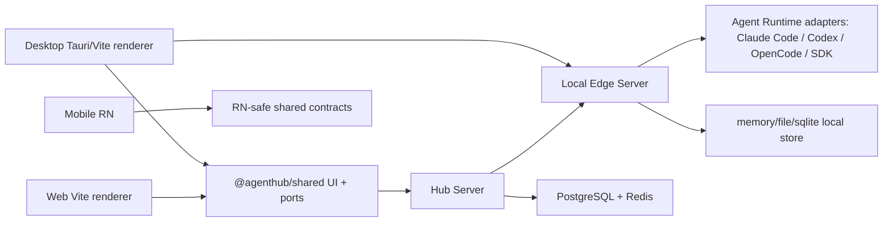

# Project Overview

> 本文是 `docs/repo-governance-real-e2e` 分支的 Phase 1 分析基线，日期：2026-06-27。

## Preliminary Direction

本轮目标是把 AgentHub 的 UIUX/真实 E2E/文档治理/项目 skill 规则收敛成一套可执行的工程闭环：先清理冲突和过时规则，再把真实 Playwright、Visual QA、后端/客户端/打包证据等级接到分支合并和验收流程里。

## Current Architecture

Current intended boundaries:

- Shared UI and transcript logic live in `app/shared`; Desktop and Web should not fork independent chat/workbench components.
- Desktop can use Local Edge plus Tauri host capabilities; Web must go through Hub and cannot direct-connect to Local Edge in production mode.
- Edge owns local execution lifecycle and runtime adapters; Hub owns account/session, IM, cloud routing, relay, audit, and collaboration APIs.
- Real evidence is layered: fixture/unit, Playwright renderer, Visual QA, stubbed Hub, observed local, approved-real runtime/API, and packaged Desktop are separate claims.

## Technology Stack

| Layer | Current | Notes |
|:--|:--|:--|
| Frontend | React 19, TypeScript, Vite, Zustand, TanStack Query | Desktop/Web share `app/shared`; Mobile consumes RN-safe contracts. |
| Desktop shell | Tauri 2, Rust host, Edge sidecar | Vite renderer tests do not prove packaged Tauri sidecar/icon/sqlite behavior. |
| Backend | Go Hub Server + Go Edge Server | Hub uses Gin/GORM/PostgreSQL/Redis; Edge owns runtime adapters and local store. |
| API contracts | `api/openapi.yaml`, `api/events.md`, shared TS event constants | Some docs still duplicate route/status facts. |
| Testing | Vitest, Playwright, Go tests, shell/PowerShell gate scripts, GitHub Actions | Gate taxonomy exists but is spread across scripts, package scripts, workflows, roadmap, and skills. |
| CI/CD | GitHub Actions, release readiness workflow, Tauri package dry gates | Release signing/notarization/release upload remain approval-gated. |

## Entry Points

| Surface | Entry |
|:--|:--|
| Desktop renderer | `app/desktop/src/App.tsx`, `app/desktop/vite.config.ts` |
| Desktop native | `app/desktop/src-tauri/` |
| Web renderer | `app/web/src/App.tsx`, `app/web/vite.config.ts` |
| Mobile RN | `app/mobile-rn/src/App.tsx`, Expo config |
| Shared UI/contracts | `app/shared/src/index.ts`, `app/shared/src/ui/`, `app/shared/src/transcript/`, `app/shared/src/workbench/` |
| Hub Server | `hub-server/cmd/server-hub/main.go` |
| Edge Server | `edge-server/cmd/agenthub-edge/main.go` |
| API schema | `api/openapi.yaml`, `api/events.md` |
| CI gates | `.github/workflows/checks.yml`, `.github/workflows/release-readiness.yml`, `scripts/verify-*.ps1` |

## Build & Run

Useful commands currently declared by the repo:

| Area | Command |
|:--|:--|
| Root frontend | `cd app && pnpm typecheck && pnpm test` |
| Desktop | `cd app/desktop && pnpm test:ci && pnpm typecheck && pnpm build` |
| Desktop chat E2E | `cd app/desktop && pnpm test:e2e:chat-flow && pnpm test:visual:chat-flow` |
| Web | `cd app/web && pnpm typecheck && pnpm build && pnpm test` |
| Web chat/stubbed Hub E2E | `cd app/web && pnpm test:e2e:chat-flow && pnpm test:e2e:stubbed-hub && pnpm test:visual:chat-flow` |
| Mobile | `cd app/mobile-rn && pnpm verify && pnpm verify:qa` |
| Edge | `cd edge-server && go test ./... -short -count=1` |
| Hub | `cd hub-server && go test ./... -short -count=1` |
| CI policy | `.\scripts\verify-ci-gates.ps1` |
| E2E smoke matrix | `.\scripts\verify-e2e-smoke-matrix.ps1 -RepoRoot .` |
| Release gate | `.\scripts\verify-release-gate.ps1` |

## Testing Baseline

Existing useful test surfaces:

- Chat flow Playwright exists for Desktop and Web and targets message ordering, visible transcript behavior, and data boundary contracts.
- Visual QA exists as `test:visual:chat-flow` for Desktop/Web, plus a broader Web `visual-qa.mjs` and Mobile `visual:qa`.
- Shared package contains transcript, markdown, API/client, agent spec, and UI tests.
- Hub/Edge Go tests exist across repository/service/handler/router/lifecycle/adapter layers.
- CI includes Go build/test/vet/vuln, frontend typecheck/build/test, backend fixture E2E, benchmark regression, Docker build, e2e smoke, and release-readiness package gates.

Known gaps:

- Vite renderer Playwright and Visual QA are useful but do not prove packaged Desktop behavior.
- Stubbed Hub tests are useful but must always report `real_tested=false` and cannot be described as real login/model/API execution.
- There is no single project-level matrix mapping claims to gates; the new `.agents/skills/real-e2e-acceptance/` begins this, but roadmap/workflows/scripts still need alignment.
- Performance/leak checks exist as benchmarks, load scripts, pprof/admin docs, and some lifecycle comments, but they are not yet classified into merge/release acceptance levels.

## Project Governance Baseline

| Surface | Current state |
|:--|:--|
| `AGENTS.md` | Canonical shared instruction surface. It now whitelists active project skills and says active spec work lives in `docs/progress/MASTER.md` only when present. |
| Platform-specific root rule files | Not used; shared project rules live in `AGENTS.md`. |
| `.agents/skills/` | Active whitelist only: `dev-loop`, `test-coverage`, `pre-push`, `integration-test`, `adapter-dev`, `env-sandbox`, `real-e2e-acceptance`. |
| `docs/archives/project-skills/` | Archived `ui-screenshot`, `dev-team`, `dev-team-codex`; archive README says agents should not load them. |
| `docs/progress/MASTER.md` | Not present at Phase 1 start; this is a fresh spec-driven run. |
| Native memory | Use platform/native memory only if explicitly updating durable memory; do not create a repo-local fallback memory file silently. |
| Other rule files | No active `.cursor`, `.windsurf`, `.codex`, or `.clinerules*` surfaces found in the repo root. |

## External Integrations

- TokenDance ID OIDC via Hub Server.
- Local Edge on `127.0.0.1:3210` for Desktop local execution.
- Hub Server local dev on `127.0.0.1:8080` and production route behind TokenDance infra.
- PostgreSQL and Redis for Hub.
- Tauri host, OS keyring, sidecar process, notifications, dialogs, and WebView2/Edge runtime for packaged Desktop.
- Agent runtimes and SDK paths: Claude Code, Codex, OpenCode, Anthropic/OpenAI SDK HTTP adapters.
- GitHub Actions, gh CLI, release artifacts, and optional Project board integration.

## GitHub Tracking Mode

Preflight result: `GITHUB_STANDARD`.

- `gh` CLI is installed and authenticated as `DeliciousBuding`.
- Repo resolved to `TokenDanceLab/AgentHub`.
- Issue access is available.
- Project access is not available because token lacks `read:project`; Project board creation should be skipped unless auth is refreshed.
