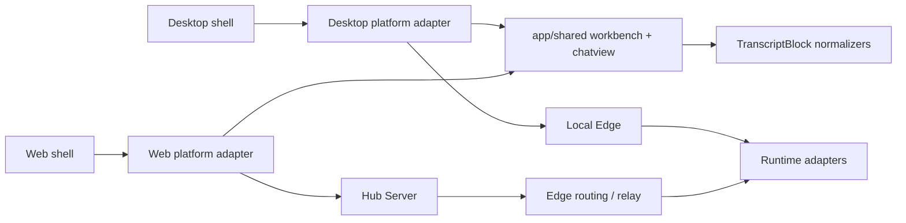

# Real Foundation Hardening - Project Overview

## Preliminary Direction

Build a real, product-grade foundation for AgentHub Desktop/Web chat workflow, shared transcript rendering, Hub/Edge data boundaries, and E2E/Visual QA evidence. Mobile is boundary-only in this SPEC.

## Current Architecture

The intended direction already exists in the code shape: Desktop and Web render through `app/shared`, while the shells provide platform adapters and data/session wiring. The unstable area is not a missing renderer; it is the product contract around real-time ordering, optimistic send, card grouping, visual QA, and honest evidence labels.

## Technology Stack

| Layer | Current | Target For This SPEC |
|:--|:--|:--|
| Shared UI | React 19, TypeScript, CSS Modules/tokens | Same, with stricter shared transcript contracts |
| Desktop | Vite renderer, Tauri 2 shell, Playwright | Same; Vite evidence remains separate from packaged Desktop evidence |
| Web | Vite, Hub-facing adapter, Playwright | Same; Web remains Hub-only |
| Hub/Edge | Go services, REST JSON, typed WS events | Contract alignment only unless task touches handlers |
| Test tooling | Vitest, Playwright, visual scripts, PowerShell verifiers | Focused E2E + Visual QA + evidence manifests |
| Package manager | pnpm/Corepack per app | No package manager change |

## Entry Points

| Surface | Entry |
|:--|:--|
| Shared transcript | `app/shared/src/transcript/`, `app/shared/src/chatview/` |
| Data-mode contract | `app/shared/src/testing/e2eDataModeContract.ts` |
| Desktop UI | `app/desktop/src/App.tsx`, `app/desktop/src/platform/`, `app/desktop/src/__e2e__/` |
| Web UI | `app/web/src/App.tsx`, `app/web/src/platform/`, `app/web/src/__e2e__/` |
| Visual QA | `app/desktop/scripts/manual-chat-flow-check.mjs`, `app/web/scripts/manual-chat-flow-check.mjs`, `app/web/scripts/visual-qa.mjs` |
| Hub/Edge contracts | `api/openapi.yaml`, `api/events.md`, `hub-server/`, `edge-server/` |

## Build And Run

| Scope | Existing Command |
|:--|:--|
| Shared tests | `corepack pnpm --dir app/shared test` |
| Desktop tests | `corepack pnpm --dir app/desktop test`, `corepack pnpm --dir app/desktop typecheck` |
| Desktop chat E2E | `corepack pnpm --dir app/desktop test:e2e:chat-flow` |
| Desktop chat Visual QA | `corepack pnpm --dir app/desktop test:visual:chat-flow` |
| Web type/build | `corepack.cmd pnpm --dir app/web typecheck`, `corepack.cmd pnpm --dir app/web build` |
| Web chat E2E | `corepack.cmd pnpm --dir app/web test:e2e:chat-flow` |
| Web stubbed Hub E2E | `corepack.cmd pnpm --dir app/web test:e2e:stubbed-hub` |
| Web chat Visual QA | `corepack.cmd pnpm --dir app/web test:visual:chat-flow` |
| Governance gates | `pwsh ./scripts/verify/verify-doc-ssot.ps1`, `pwsh ./scripts/verify/verify-real-e2e-contract.ps1`, `pwsh ./scripts/verify/verify-project-skills.ps1` |

## Testing Baseline

Useful existing coverage:

- `app/shared/src/transcript/*test.ts` covers Hub/Edge normalization, ordering, runtime diagnostics, and evidence.
- `app/shared/src/chatview/*test.tsx` covers adapter integration, markdown rendering, CSS contract, and auto-follow.
- `app/desktop/src/__e2e__/chat-flow-ui.spec.ts` covers optimistic send, no flash/disappear, scroll follow, no debug labels, no overflow, and merged approval/preview card stack.
- `app/web/src/__e2e__/chat-flow-contract.spec.ts` covers Hub-shaped replay, markdown table rendering, tool result ordering, inspector-only subagent details, optimistic send, and Web boundary assertions.
- `app/shared/src/testing/e2eDataModeContract.ts` separates surface, data source, auth/execution, request phase, and `real_tested`.

Current gaps:

- Web full visual QA still uses `1440x920` scene naming/viewport while architecture acceptance names `1440x810`.
- Visual QA is split between manual chat-flow scripts and broader Web visual QA; there is no project-level manifest that clearly records automated vs semi-automated evidence.
- Existing tests protect key regressions, but the acceptance bundle is not yet a single reusable gate for "chat workflow is merge-ready".
- Packaged Desktop sidecar/sqlite/icon/installer claims remain outside Vite Playwright and must stay separately gated.

## Project Governance Baseline

| Surface | Current Resolution |
|:--|:--|
| Shared agent rules | `AGENTS.md` is the only project rule entry |
| Claude-specific rules | None; no separate Claude-only rule surface is active |
| Current SPEC state | No active `docs/progress/MASTER.md` before this branch |
| Durable project skill | `.agents/skills/real-e2e-acceptance/SKILL.md` |
| Native memory | Codex memory is available for prior AgentHub worktree and approved-real guidance |
| Repo fallback memory | None selected; do not create one silently |
| GitHub mode | `GITHUB_STANDARD`: repo/issues work; Projects scope missing |

## External Integrations

| Integration | Boundary |
|:--|:--|
| Hub Server | Web/Desktop Hub session, IM messages, agent-task events |
| Local Edge | Desktop local execution and health preflight only; Web cannot direct-call it |
| TokenDance ID | Real login proof only when approved-real login gates run |
| Runtime CLIs / model APIs | No real spend/CLI claim without explicit approved-real evidence |
| Tauri packaged Desktop | Separate packaged-release evidence, not proven by Vite renderer E2E |
