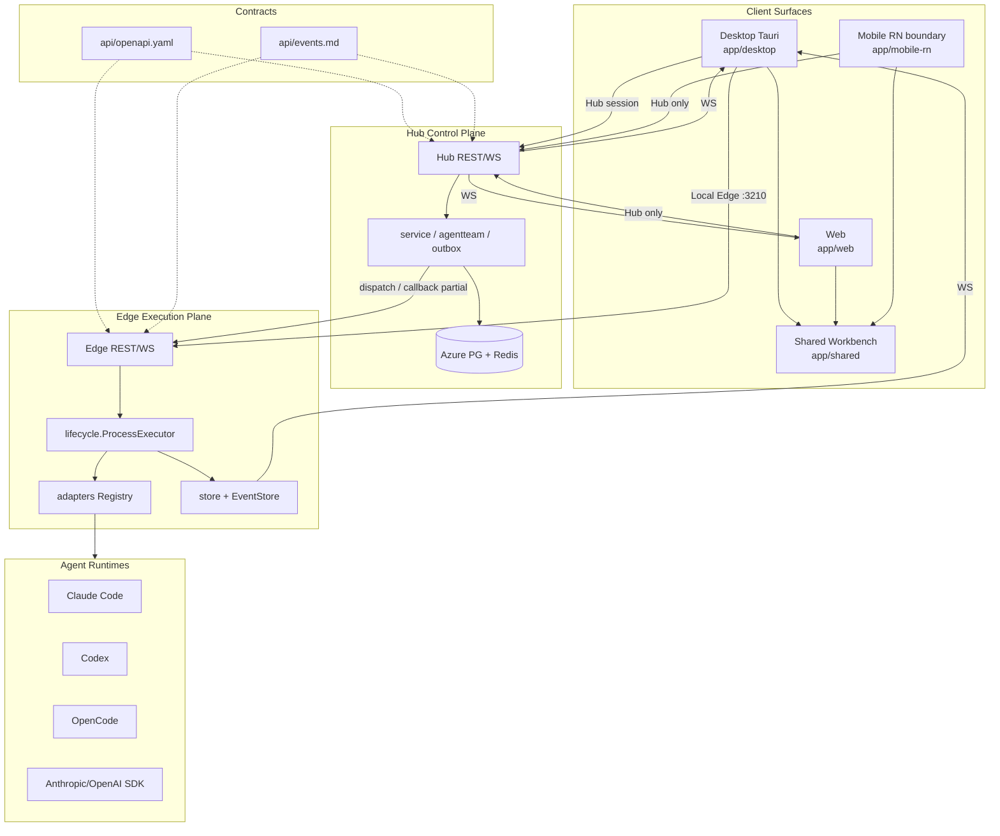

# AgentHub 项目总览（Cleanup Baseline）

> last-updated: 2026-07-18
> scope: cleanup baseline synthesis（Architecture / Hub / Edge / Frontend / Risks + 主会话卫生债）
> authority: 综合 discovery lanes；**不替代** `AGENTS.md` / `docs/architecture.md` / `docs/progress/MASTER.md` / server STATE
> note: completion cells use absolute dates or history pointers only; live progress is MASTER Phase 65

## Preliminary Direction

**结论：不做 big-bang rewrite；做 knowledge-first + strangler 增量清理。**

AgentHub 已具备正确且大体落地的双平面骨架：

| 平面 | 职责 | 目录 |
|---|---|---|
| **Hub** | 身份会话、IM/同步、路由、审计、TeamRun、设备路由 | `hub-server/` |
| **Edge** | 本地执行权威：lifecycle、adapters、EventStore、workspace | `edge-server/` |
| **Workbench UI** | Desktop / Web / Mobile 共享 transcript + workbench 合同 | `app/shared/` + surface shells |

当前清理对象不是“缺架构”，而是：

1. **生产叙事漂移**：CI / 部分模板可能残留 decommissioned 叙述；live 事实只读 external server STATE
2. **安全半落地**：AH-SR-* 以 `docs/governance/security-risk-register.md` 为准；本 overview 不复述 Open 状态
3. **巨石与分叉**：Edge handlers / ProcessExecutor、Hub flat service residual peels、前端分叉
4. **卫生债**：`reference/` ignored 克隆、`.worktrees`、scripts readiness 面、本地 dirty noise

权威程序指针：`cleanup-strategy.md`（归档）+ 活进度 `docs/progress/MASTER.md`；轻量 `wiki/` 为编译知识层（非第二 SSOT）。

## Current Architecture



### 非协商边界

1. Hub **不**直接启动 CLI；本地执行只在 Edge（Desktop 可托管 Local Edge）。
2. Web / Mobile **不能** Local Edge；仅 Desktop `capabilities.localEdge: true`。
3. Desktop renderer **无** raw process execution；危险能力经 typed Tauri host + Local Edge。
4. TokenDance ID 只证明身份；Hub-local membership/resource/action 做授权。
5. TokenDance API key 不进浏览器 UI / 公开日志。
6. Mock / fixture / observed / approved-real / production 必须显式区分。
7. 主协议 REST JSON + typed WS；Protobuf / Connect-RPC / JSON-RPC 仅历史。

### 前端分层（已基本正确）

```text
surface shell → platform adapter (AgentHubPlatform)
  → shared workbench / transcript / chatview
    → Hub REST/WS  and/or  Local Edge (Desktop only)
```

shared UI **不得**直接调用 Tauri / Hub / Edge 客户端。

## Technology Stack

| 层 | 技术 | 备注 |
|---|---|---|
| Hub / Edge | Go 1.25 workspace（`hub-server` / `edge-server` / `pkg`） | `go.work` |
| 数据 | PostgreSQL + Redis | 生产 Azure PG role `agenthub` |
| 协议 | REST JSON + typed WebSocket | Hub 成功包络 `{code:OK,data}`；Edge 多为 bare JSON |
| 前端 | React + TypeScript + pnpm workspace | `app/shared` / `desktop` / `web` / `mobile-rn` |
| Desktop host | Tauri + Rust | Vite renderer ≠ packaged 证据 |
| Mobile | Expo / React Native | 本轮 boundary-only |
| 契约 | `api/openapi.yaml` + `events.md` + `conventions.md` | OpenAPI 混编 Hub+Edge 表面 |
| 验证 | `scripts/{verify,dev,smoke,release,lib}` | ~63 ps1；体感 ~80 家族脚本 |
| 部署 | `deployments/production/` + server compose | 秘密不在本仓 |

### 规模线索（约数，worktree 扫描）

| 区域 | 规模 | 说明 |
|---|---|---|
| `edge-server` | ~33k prod / ~47k test | 执行面最大；adapters prod~12k/test~16k |
| `hub-server` | ~29k prod / ~46k test | service prod~12k |
| `app/shared` | ~62k prod / ~17k test | workbench 巨文件集中 |
| `app/desktop` | ~54k prod / ~16k test | + Tauri ~4k |
| `app/web` | ~26k prod / ~8k test | Hub-only |
| `app/mobile-rn` | ~12k prod / ~7k test | 非 UI 主线 |
| `api/` | openapi ~7.5k lines | 合同巨石 |
| `reference/` | ~3.7G ignored | 仅 `INDEX.md` 跟踪 |
| `.worktrees/` | ~4.6G 本地 | 不进 git |

## Entry Points

| 入口 | 路径 | 说明 |
|---|---|---|
| 项目规则 | `AGENTS.md` | 唯一规则 SSOT |
| 架构 | `docs/architecture.md` + `docs/architecture/*` | 01–07 子文档 |
| 总进度入口 | `docs/roadmap.md` | 指针；活状态不写在本表 |
| 专项进度 | `docs/progress/MASTER.md` | **活进度 SSOT**（Phase 65 / milestone 85，2026-07-18） |
| 安全 | `docs/governance/security-risk-register.md` | 发布门禁 |
| Hub 进程 | `hub-server/cmd/server-hub` | 本地 `:8080` |
| Edge 进程 | `edge-server/cmd/agenthub-edge` | 本地 `127.0.0.1:3210` |
| Desktop | `app/desktop` Vite `:5173` | packaged 另证 |
| Web | `app/web` Vite `:5174` | Hub-only |
| Mobile Expo Web | `app/mobile-rn` `:5177` | boundary |
| REST | `api/openapi.yaml` | 运行时路径以 router 为准 |
| WS | `api/events.md` | Edge envelope vs Hub flat frame |
| 生产 live | external server STATE（`projects/agenthub`） | **in-repo 不嵌入 host 事实** |
| 本基线 | `docs/analysis/*` | overview / inventory / risk / strategy |

## Build & Run

最短本地路径（细节：`docs/developer-quickstart.md`）：

```bash
docker compose up -d postgres redis

cd hub-server && go run ./cmd/server-hub          # :8080/health
cd edge-server && go run ./cmd/agenthub-edge      # :3210/v1/health

cd app && corepack pnpm install                   # monorepo once
cd app/web && corepack pnpm dev                   # :5174
cd app/desktop && corepack pnpm dev               # :5173
cd app/desktop && corepack pnpm tauri dev         # native
# optional: make fe-install / make fe-dev
```

固定端口 SSOT（`AGENTS.md`）：Desktop 5173、Web 5174、Mobile Expo Web 5177、Hub 8080、Local Edge 3210。

生产形状：

- 仓库内模板：`deployments/production/docker-compose.yml`（非 live ops SSOT）
- live 事实：external server STATE only（`projects/agenthub`）；**不在源仓嵌入 host 标签**
- 镜像名仍可能漂移：`agenthub-hub` vs `agenthub-hub-server`（对齐任务见 progress，不在此复述）

## Testing Baseline

| 表面 | 最低命令 / 证据 | 边界 |
|---|---|---|
| 任意变更 | `git diff --check` + `git status --short --branch` | 强制 |
| 文档 / API | `scripts/verify/verify-doc-ssot.ps1` + OpenAPI YAML parse | 强制 |
| Edge / Hub | `go test ./... -short -count=1`（touched service） | 大量 `*_test.go` |
| Desktop | `pnpm test` + `pnpm typecheck` | Vite ≠ packaged |
| Web | `pnpm typecheck` + `vite build` | Hub-only |
| UI 行为 | shared unit/contract + Playwright + Visual QA | 主视口 `1440x810` |
| 真实登录 / 模型 / API | `.agents/skills/real-e2e-acceptance/SKILL.md` | 禁止 readiness 冒充 real |
| 性能 / 泄漏 | `docs/reference/backend-performance-gates.md` | path-level |

观察：Hub/Edge 测试体量常大于生产（保护力高，也有 mega-test / `time.Sleep` 卫生问题）。scripts 中大量 readiness-only，必须与 approved-real 分离。

## Project Governance Baseline

| 主题 | SSOT | 说明 |
|---|---|---|
| 规则 | `AGENTS.md` | 无第二套根级规则文件 |
| 总进度入口 | `docs/roadmap.md` | 指针到 history / MASTER |
| 专项 | `docs/progress/MASTER.md` | Phase 65 活进度（2026-07-18） |
| 架构 / 决策 | `docs/architecture*`、`docs/decisions.md` | 旧 ADR 外迁 |
| 安全 | `docs/governance/*` | Critical/High Open 阻断公开发布 |
| Skill 白名单 | `.agents/skills/*` + verify 脚本 | 过期 skill 不得 active |
| 分支 | `feat/*|docs/*` → `dev/delicious233` → `master` | worktree 在 `.worktrees/` |
| 历史 | `docs/history.md` + `docs/archives/` | cleanup-baseline 归档于 archives |
| 脚本布局 | `scripts/{verify,dev,smoke,release,lib}` | **禁止**新根级 wrapper |

## External Integrations

| 集成 | 角色 | 边界 |
|---|---|---|
| TokenDance ID | OIDC 登录 / 身份 | 不做 AgentHub 业务授权 |
| TokenDance Gateway | 模型 / API 路由 | API key 不进浏览器 |
| Feishu / Lark | 协作入口 / 卡片 | 非第二登录；回调 3s 内 |
| Azure PostgreSQL | Hub 生产库 | role `agenthub`（2026-07-15 切流） |
| Redis | session / cache / 部分 relay | 生产拓扑见 external server STATE |
| Runtime CLI/SDK | Claude Code / Codex / OpenCode / Anthropic / OpenAI | 仅 Edge adapters |
| GHCR / GitHub Actions | 镜像与 CI | 部分 CD 仍 dry-run / 文档式 |

## Production Reality

**生产 live 事实不在源仓维护。** 权威：external server STATE（`projects/agenthub`）+ `deployments/production/` 模板 + `docs/architecture/05-deployment.md` 短指针。

| 项 | 说明 |
|---|---|
| Live role / host / compose path | external server STATE only |
| 仓库模板 | `deployments/production/`（非 live SSOT） |
| 健康探针形状 | Hub 本地开发 `:8080/health`；生产路径以 ops STATE 为准 |

### 必须同时记住的漂移

1. 部分 CI / 旧模板可能残留 decommissioned 叙述 —— 叙事漂移，待修，**不是**生产真相。
2. server STATE 的历史段落可能夹杂旧拓扑 —— 勿覆盖 Current Role。
3. 镜像名、旧 `hub-server/deployments/docker-compose.prod.yml` 本地 PG 形状可能过时。

### 卫生债（主会话补充，lanes 未全覆盖）

| 债面 | 事实 | 原则 |
|---|---|---|
| `reference/` | ~3.7G ignored 研究克隆；跟踪 `INDEX.md` | 不提交克隆；非产品 SSOT |
| `.worktrees/` | ~4.6G | 任务后删除 |
| scripts | ~80 家族 / ~63 ps1，多 readiness | 分类保留；删重复 |
| dirty main noise | 本地删 tauri android gen、`hub-server/server-hub` binary 等 | 本机噪声，不写进产品叙事 |

## 相关基线文档

| 文档 | 内容 |
|---|---|
| `module-inventory.md` | 模块 Files/LOC、复杂度、S.U.P.E.R 灯号 |
| `risk-assessment.md` | 矛盾、Open High、PARTIAL 046/049、测试与卫生风险 |
| `cleanup-strategy.md` | 归档程序指针；活进度 `docs/progress/MASTER.md` |

## 一句话结论

边界与分层已正确；清理对象是 **叙事漂移、安全半成品接线、god-file 浓度、前端分叉与仓库卫生**。路径是 **strangler + 轻量 wiki 编译层**；生产状态只读 external ops，不在源仓嵌入 host 事实。
