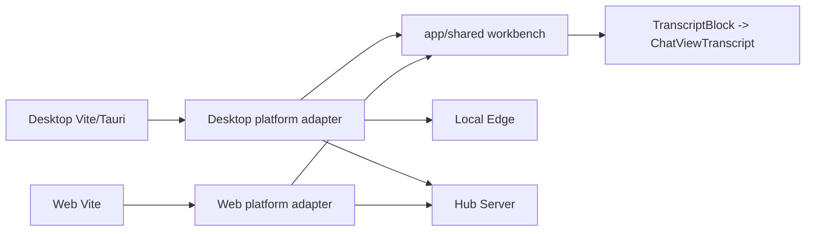

# Chat UIUX Data Mode E2E Project Overview

## Preliminary Direction

把 AgentHub Desktop/Web 聊天流、数据模式和前端 E2E 验收整理成 SPEC-first 的可靠工程合同：先分清 Demo/Fixture/Local/Login/Observed/Approved Real，再修复 UIUX 和测试。

## Current Architecture

Architecture constraints confirmed from project docs:

- `app/shared` owns shared workbench, transcript contract, composer, inspector, and chat rendering.
- `app/shared/src/chatview` is the only card rendering system.
- Web must go through Hub and must not direct-call Local Edge.
- Desktop may use Local Edge only in Local/Observed/Approved Real paths or explicit entry preflight.
- `mock`, `fixture`, `observed`, `approved-real`, and production/real paths must be explicit.

## Technology Stack

| Layer | Current | Target For This Work |
|---|---|---|
| UI | React + TypeScript | unchanged |
| Build | Vite, pnpm/corepack | unchanged |
| Desktop shell | Tauri, Vite renderer | Vite renderer E2E now; packaged Tauri separate gate |
| Web shell | Vite web app | unchanged |
| Shared rendering | `app/shared/src/chatview` | keep shared |
| Tests | Vitest + Playwright | focused behavior/boundary suite |

## Entry Points

- Desktop app entry: `app/desktop/src/App.tsx`
- Desktop workbench model: `app/desktop/src/platform/useDesktopWorkbenchModel.ts`
- Desktop health hook: `app/desktop/src/hooks/useHealth.ts`
- Web app entry: `app/web/src/App.tsx`
- Web workbench model: `app/web/src/platform/useWebWorkbenchModel.ts`
- Shared chat entry: `app/shared/src/workbench/ConversationHost.tsx` and `app/shared/src/chatview/components/Transcript.tsx`
- Shared data mode contract: `app/shared/src/demo/dataMode.ts`
- E2E boundary helper: `app/shared/src/testing/e2eDataModeContract.ts`

## Build And Run

Relevant commands are listed in `docs/plan/chat-uiux-data-mode-e2e-spec.md`. Desktop Vite E2E uses port `5199`; Web Vite E2E uses port `5174`; primary visual viewport is `1440x810`.

## Testing Baseline

Useful existing/partial surfaces:

- Playwright Desktop chat-flow spec already checks submitted message stability, duplicate messages, auto-follow, overflow, and merged card geometry.
- Playwright Web chat-flow spec already checks Hub messages plus runtime events in one shared transcript, markdown table rendering, tool pairing, and inspector-only route/subagent details.
- Vitest covers data-mode contract, Desktop health enable/disable behavior, Desktop model data-mode isolation, Web transcript/runtime helper behavior, and shared transcript ordering.

Closed baseline:

- Desktop Playwright originally failed because entry `/v1/health` requests were counted against mock workbench runtime. The current E2E contract is phase-aware, so entry preflight and workbench runtime are validated separately.

## Project Governance Baseline

- Shared workspace rules: `D:\Code\TokenDance\AGENTS.md`
- Repo rules: `D:\Code\TokenDance\AgentHub\AGENTS.md`
- Active progress SSOT: `docs/progress/MASTER.md`
- Tracking mode for this task: `LOCAL_ONLY`
- This work must not claim real login/model/API/deploy execution unless those paths are actually run and approved.

## External Integrations

- Local Edge: `127.0.0.1:3210`
- Hub Server: local development origin `http://localhost:8080`
- TokenDance ID and Gateway are out of scope unless explicitly approved-real tested.
