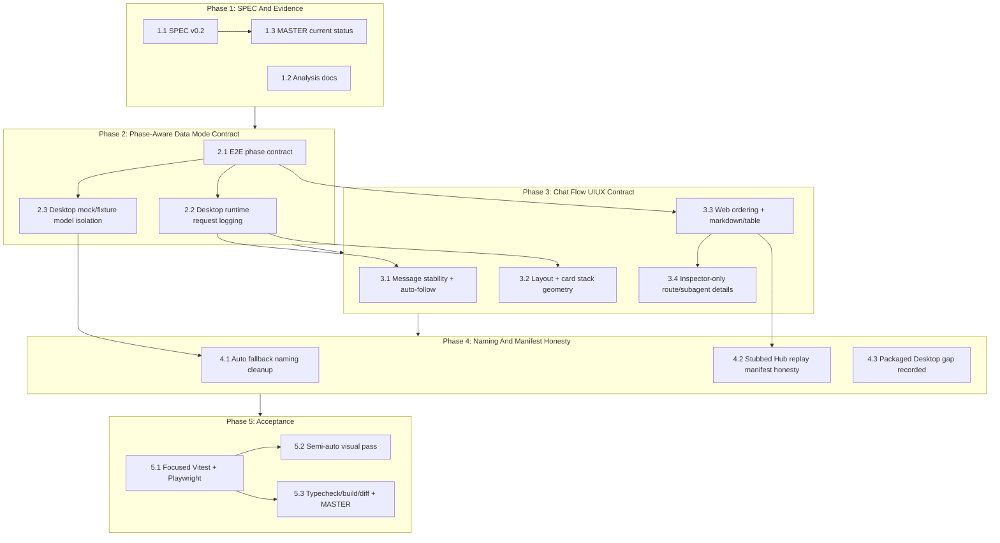

# Chat UIUX Data Mode E2E Dependency Graph

```mermaid
graph TD
  subgraph P1["Phase 1: SPEC And Evidence"]
    T11["1.1 SPEC v0.2"]
    T12["1.2 Analysis docs"]
    T13["1.3 MASTER current status"]
    T11 --> T13
  end

  subgraph P2["Phase 2: Phase-Aware Data Mode Contract"]
    T21["2.1 E2E phase contract"]
    T22["2.2 Desktop runtime request logging"]
    T23["2.3 Desktop mock/fixture model isolation"]
    T21 --> T22
    T21 --> T23
  end

  subgraph P3["Phase 3: Chat Flow UIUX Contract"]
    T31["3.1 Message stability + auto-follow"]
    T32["3.2 Layout + card stack geometry"]
    T33["3.3 Web ordering + markdown/table"]
    T34["3.4 Inspector-only route/subagent details"]
    T22 --> T31
    T22 --> T32
    T21 --> T33
    T33 --> T34
  end

  subgraph P4["Phase 4: Naming And Manifest Honesty"]
    T41["4.1 Auto fallback naming cleanup"]
    T42["4.2 Stubbed Hub replay manifest honesty"]
    T43["4.3 Packaged Desktop gap recorded"]
    T23 --> T41
    T33 --> T42
  end

  subgraph P5["Phase 5: Acceptance"]
    T51["5.1 Focused Vitest + Playwright"]
    T52["5.2 Semi-auto visual pass"]
    T53["5.3 Typecheck/build/diff + MASTER"]
    T51 --> T52
    T51 --> T53
  end

  P1 --> P2
  P2 --> P3
  P3 --> P4
  P4 --> P5
```
