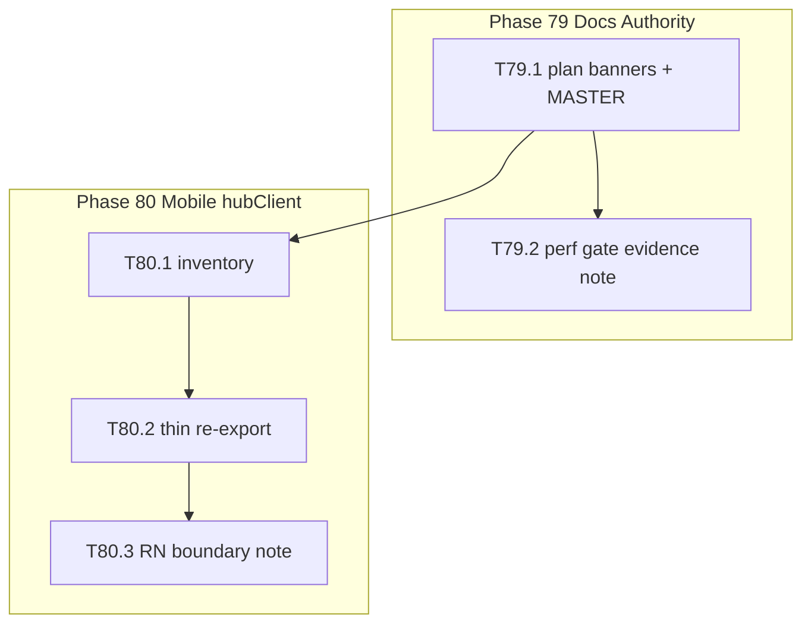

# Dependency Graph — Post-Polish Residual

> pending external archive — see docs/history.md

## Parallelism

- B1 (docs) and B2 inventory (T80.1) can start after T79.1 lands; default serial for single-owner velocity.
- No file overlap between B1 and B2.
