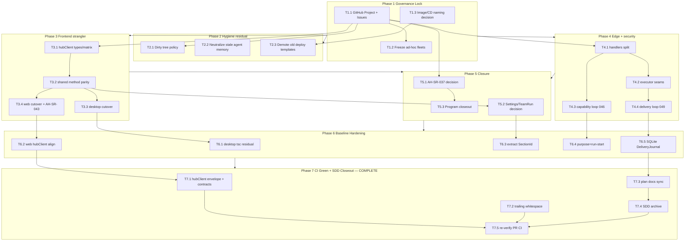

# Task Dependency Graph

> **HISTORICAL — cleanup-baseline freeze (closed 2026-07-16 / PR #446).**
> **Not live backlog.** Live program SSOT: [../progress/MASTER.md](../progress/MASTER.md) (post-polish residual Phases 79–80).
> Snapshot also under [../archives/cleanup-baseline/plan/](../archives/cleanup-baseline/plan/).

