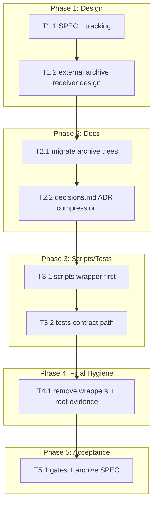

# Dependency Graph

```mermaid
flowchart TD
  subgraph "Phase 1: Design"
    T11["T1.1 SPEC + tracking"]
    T12["T1.2 external archive receiver design"]
  end
  subgraph "Phase 2: Docs"
    T21["T2.1 migrate archive trees"]
    T22["T2.2 decisions.md ADR compression"]
  end
  subgraph "Phase 3: Scripts/Tests"
    T31["T3.1 scripts wrapper-first"]
    T32["T3.2 tests contract path"]
  end
  subgraph "Phase 4: Final Hygiene"
    T41["T4.1 remove wrappers + root evidence"]
  end
  subgraph "Phase 5: Acceptance"
    T51["T5.1 gates + archive SPEC"]
  end

  T11 --> T12 --> T21 --> T22 --> T31 --> T32 --> T41 --> T51
```
