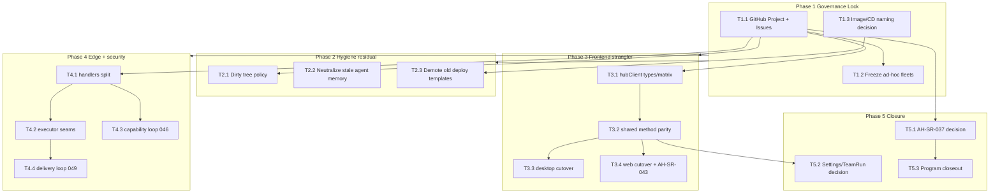

# Task Dependency Graph

```mermaid
graph TD
  subgraph P1 [Phase 1 Governance Lock]
    T11[T1.1 GitHub Project + Issues]
    T12[T1.2 Freeze ad-hoc fleets]
    T13[T1.3 Image/CD naming decision]
    T11 --> T12
  end

  subgraph P2 [Phase 2 Hygiene residual]
    T21[T2.1 Dirty tree policy]
    T22[T2.2 Neutralize stale agent memory]
    T23[T2.3 Demote old deploy templates]
    T11 --> T21
    T13 --> T23
  end

  subgraph P3 [Phase 3 Frontend strangler]
    T31[T3.1 hubClient types/matrix]
    T32[T3.2 shared method parity]
    T33[T3.3 desktop cutover]
    T34[T3.4 web cutover + AH-SR-043]
    T11 --> T31
    T31 --> T32
    T32 --> T33
    T32 --> T34
  end

  subgraph P4 [Phase 4 Edge + security]
    T41[T4.1 handlers split]
    T42[T4.2 executor seams]
    T43[T4.3 capability loop 046]
    T44[T4.4 delivery loop 049]
    T11 --> T41
    T41 --> T42
    T41 --> T43
    T42 --> T44
  end

  subgraph P5 [Phase 5 Closure]
    T51[T5.1 AH-SR-037 decision]
    T52[T5.2 Settings/TeamRun decision]
    T53[T5.3 Program closeout]
    T11 --> T51
    T32 --> T52
    T51 --> T53
  end

  P1 --> P2
  P1 --> P3
  P1 --> P4
```
