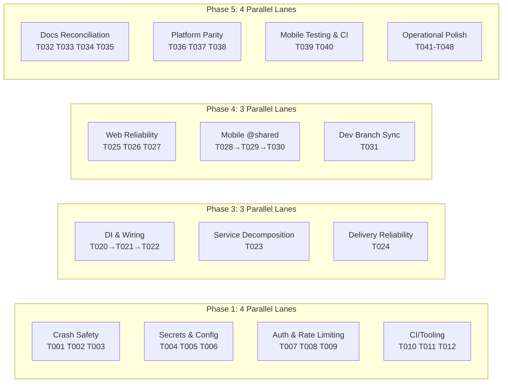

# AgentHub SUPER 修复 — 依赖图与里程碑

> 生成日期：2026-06-19 | Phase 3 | Spec-Driven Develop

## 整体依赖图

```mermaid
graph TB
    subgraph Phase1["Phase 1: Backend Safety & Foundation"]
        T001[T001: Gin Recovery]
        T002[T002: security_hooks panic→error]
        T003[T003: error leak fix]
        T004[T004: Redis healthcheck leak]
        T005[T005: dev_password strip]
        T006[T006: hk2 compose→override]
        T007[T007: rate limiter fail-open]
        T008[T008: WS auth.ok race]
        T009[T009: OIDC redirect_uri validation]
        T010[T010: Vitest ESM fix]
        T011[T011: release.sh re-implement]
        T012[T012: CI vuln scanning]
    end

    subgraph Phase2["Phase 2: Edge Security Hardening"]
        T013[T013: Edge remote auth AH-SR-045]
        T014[T014: Edge dual-token AH-SR-046]
        T015[T015: Edge env whitelist AH-SR-047]
        T016[T016: JWT key rotation]
        T017[T017: WS InsecureSkipVerify fix]
        T018[T018: WS ReadTimeout]
        T019[T019: rate limiter off-by-one]
    end

    subgraph Phase3["Phase 3: Architecture Refactoring"]
        T020[T020: app.go split 5 files]
        T021[T021: fix circular refs]
        T022[T022: AGENTHUB_ENV→ServerConfig]
        T023[T023: agent_team.go split 6 files]
        T024[T024: Hub-Edge outbox AH-SR-049]
    end

    subgraph Phase4["Phase 4: Frontend & Mobile Quality"]
        T025[T025: Web ErrorBoundary]
        T026[T026: HubClient timeout]
        T027[T027: surface silent errors]
        T028[T028: Mobile→@shared]
        T029[T029: Mobile typecheck fix]
        T030[T030: Mobile screen tests]
        T031[T031: dev branch sync]
    end

    subgraph Phase5["Phase 5: Docs, Platform & Polish"]
        T032[T032: API doc reconcile]
        T033[T033: WS event count fix]
        T034[T034: phase naming unify]
        T035[T035: quickstart stale fix]
        T036[T036: bash script equivalents]
        T037[T037: arch docs stale fix]
        T038[T038: per-package README fix]
        T039[T039: Mobile primitive tests]
        T040[T040: Mobile CI job]
        T041[T041: dompurify update]
        T042[T042: Redis timeout config]
        T043[T043: migration cache TTL]
        T044[T044: stats bucketing]
        T045[T045: dedup normalizeJSON]
        T046[T046: session param disambiguate]
        T047[T047: team create validation]
        T048[T048: TaskAck warning]
    end

    subgraph Phase6["Phase 6: Deferred"]
        T049[T049: auth evidence prep]
        T050[T050: Web session decision]
        T051[T051: signing cert]
        T052[T052: DB schema doc]
    end

    Phase1 --> Phase2
    Phase2 --> Phase3
    Phase3 --> Phase4
    Phase4 --> Phase5
    Phase5 --> Phase6

    T004 --> T006
    T005 --> T006
    T013 --> T014
    T020 --> T021
    T020 --> T022
    T020 --> T024
    T028 --> T029
    T028 --> T030
    T029 --> T030
    T020 --> T031
    T021 --> T031
    T023 --> T031
    T010 --> T031
    T029 --> T031
    T011 --> T031
    T034 --> T037
    T037 --> T038
    T028 --> T039
    T029 --> T039
    T029 --> T040
    T030 --> T040
```

## Phase 内部并行 Lane

---

## 里程碑

### M1: 后端安全基线（Phase 1 完成）

**目标**：所有进程崩溃路径修复、密钥泄漏清零、CI 工具链恢复

- [ ] hub-server handler panic 不再崩溃进程
- [ ] Docker 容器不泄漏 Redis/DB 密码
- [ ] 9 个 ESM 测试文件恢复通过
- [ ] release.sh 恢复所有丢失功能
- [ ] CI 包含漏洞扫描

### M2: Edge 安全边界（Phase 2 完成）

**目标**：Edge 远程执行具备生产级授权和审计

- [ ] Edge 远程读路由按资源授权
- [ ] Run-start 双 token 信任模型就位
- [ ] 子进程只能访问显式允许的环境变量
- [ ] JWT 密钥轮换机制可用

### M3: 架构债务清偿（Phase 3 完成）

**目标**：消除 S.U.P.E.R 违规热点，建立可靠交付合约

- [ ] app.go 拆分为 5 个文件，入口 <50 行
- [ ] agent_team.go 拆分为 6 文件 + facade
- [ ] 零服务层循环引用
- [ ] Hub-Edge 交付 outbox/journal 就位

### M4: 前端与 Mobile 质量基线（Phase 4 完成）

**目标**：Web 不白屏、Mobile 接入 @shared、分支同步

- [ ] Web 有 root ErrorBoundary
- [ ] HubClient 30s 超时不挂死
- [ ] Mobile 连接到 @shared 共享类型
- [ ] Mobile typecheck 零错误
- [ ] dev 分支与 master 同步

### M5: 文档一致与平台完备（Phase 5 完成）

**目标**：文档与代码一致、bash 等价脚本就位、Mobile CI 运行

- [ ] openapi.yaml 与 router.go 零不匹配
- [ ] 阶段命名统一为 Phase 1-7
- [ ] 6 个关键脚本有 bash 等价版
- [ ] Mobile CI job 运行 typecheck + tests
- [ ] 所有架构文档不再引用已删除组件

### M6: 发布就绪（Phase 1-5 全部完成）

**目标**：SUPER 分数从 63 提升到 ≥80，release gate 通过

- [ ] 所有 P0 代码可修项已关闭
- [ ] scripts/verify-release-gate.ps1 通过
- [ ] 所有部署配置无硬编码密钥
- [ ] 文档与代码事实一致
