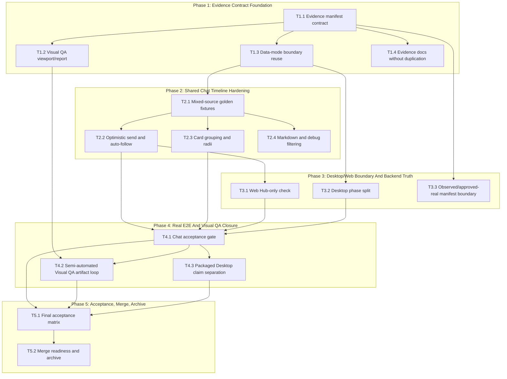

# Real Foundation Hardening - Dependency Graph

## Parallel Lane Notes

- Phase 1 can split evidence manifest/data-boundary work from docs, but Visual QA report work depends on the manifest shape.
- Phase 2 can split optimistic send/scroll from card/markdown rendering after golden fixtures exist.
- Phase 3 should run Web, Desktop, and manifest boundary work in separate worktrees to reduce conflicts.
- Phase 4 should keep acceptance-gate scripting separate from the semi-automated Visual QA artifact loop.
