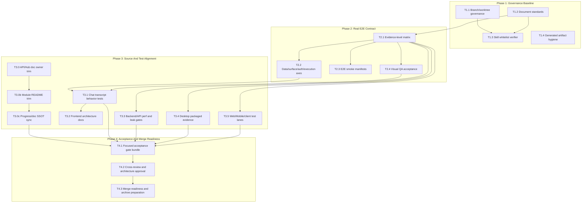

# Task Dependency Graph

## Parallel Lane Notes

- Phase 1 can start with lanes A/B/D in parallel; T1.3 waits for T1.1 and T1.2.
- Phase 2 can run T2.3 and T2.4 after T2.1; T2.2 is higher merge risk because it may touch shared source contracts.
- Phase 3 lanes should use separate worktrees if run by multiple agents because frontend, backend, desktop package, and mobile/web lanes are mostly independent.
- Phase 4 is intentionally sequential because evidence, review, and merge readiness depend on the combined diff.
