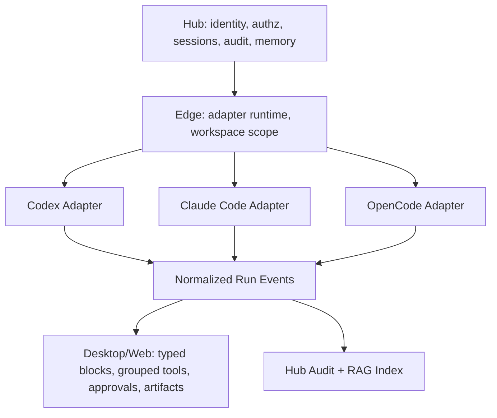

# Cherry Studio Agent Runtime 源码经验

> 范围：状态/数据流、IPC/API/SSE、Claude Code SDK、任务调度、Channel adapter、Provider/model、memory。
> 重点：抽取 AgentHub 可复用的 runtime 结构，同时明确不适合多端 Hub/Edge 的本地捷径。

---

## 1. State 与数据所有权

Cherry renderer 使用 Redux Toolkit + redux-persist：

- store slices 包含 assistants、llm、settings、runtime、knowledge、mcp、memory、messages、messageBlocks、tabs、toolPermissions 等，见 `src/renderer/src/store/index.ts:56-91`。
- `runtime`、`messages`、`messageBlocks`、`tabs`、`toolPermissions` 等 volatile state 不持久化。
- Dexie IndexedDB 保存 files、topics、settings、knowledge_notes、message_blocks 等，见 `src/renderer/src/databases/index.ts:31-138`。
- `DbService` 将普通 chat topic 写 Dexie，但把 `agent-session:*` 转到 IPC/backend source，见 `src/renderer/src/services/db/DbService.ts:28-66`。
- cross-window sync 只广播 allowlist action prefix，见 `src/renderer/src/services/StoreSyncService.ts:55-70`。

反模式：

- `ReduxService` 通过 `webContents.executeJavaScript` 读写 renderer store，见 `src/main/services/ReduxService.ts:83-113`。
- local API server 再通过这个路径读取 provider/config。单机 app 可接受，AgentHub 不能复制。

AgentHub 规则：

- Hub owns：user/org/session metadata、authz、audit、long-lived memory、artifact index、provider profile metadata。
- Edge owns：runtime process、tool execution、workspace scope、stream events、local adapter state。
- Desktop/Web owns：UI cache、layout preference、draft input、selection state。
- Renderer 不能成为 Hub/Edge 的 source of truth。

---

## 2. IPC、Local API 与 SSE

Cherry 有三条调用路径：

| 路径 | 用途 | 证据 |
|---|---|---|
| renderer -> preload -> main IPC | config、MCP、agent stream、desktop capability | `src/preload/index.ts:99-110`, `src/preload/index.ts:841-856` |
| renderer -> local HTTP API | `/v1` chat/models/agents/channels/tasks/MCP/knowledge | `src/main/apiServer/app.ts:150-166`; `src/renderer/src/api/agent.ts:70-124` |
| local API -> SSE stream | agent session message streaming | `src/main/apiServer/routes/agents/handlers/messages.ts:45-257` |

SSE 的可采纳点：

- response headers 明确 SSE。
- 监听 `res.close`、`req.aborted`、`req.close` 处理 client disconnect。
- timeout 写入 SSE error 后关闭。
- final sentinel `[DONE]`。
- disconnect 后 abort backend stream，避免进程泄露。

AgentHub 采纳：

- Hub/Web 用 SSE 或 WebSocket 暴露 normalized run events。
- Edge/Desktop 对本机 adapter 使用 IPC/local bridge，但 event payload 必须与 Hub run event schema 对齐。
- Codex/Claude Code/OpenCode adapters 都输出统一 event：text delta、tool call、tool result、approval request、artifact、error、done。

---

## 3. Agent DB 与 Session Service

Cherry 的 agent domain 已有清晰 local schema：

- agents table 包含 `type`、`accessible_paths`、`model`、`plan_model`、`small_model`、`mcps`、`allowed_tools`、`configuration`，见 `src/main/services/agents/database/schema/agents.schema.ts:7-24`。
- `AgentService` 负责 CRUD、路径解析、model validation、builtin agent bootstrap、skill seeding、agent -> session settings sync，见 `src/main/services/agents/services/AgentService.ts`。
- `SessionMessageService` 串接 ClaudeCodeService streaming，并持久化 optional messages，见 `src/main/services/agents/services/SessionMessageService.ts`。

AgentHub 对照：

| Cherry 字段 | AgentHub 对应 | 变化 |
|---|---|---|
| `accessible_paths` | Target/workspace scope | 不直接公开 raw path，UI 默认显示 friendly label |
| `allowed_tools` | approval policy / tool allowlist | Edge enforce + Hub audit |
| `configuration.env_vars` | adapter env profile | blocklist + secret reference，不写公开文档 |
| `model/plan_model/small_model` | role-based model route | Hub profile 管理，Edge 消费 |
| `mcps` | tool registry/capability | Hub registry + Edge local availability |

---

## 4. Claude Code SDK 集成

Cherry 的 `ClaudeCodeService` 是本次最重要的 runtime 参考：

- 使用 `@anthropic-ai/claude-agent-sdk`，见 `package.json:87` 和 `src/main/services/agents/services/claudecode/index.ts:939`。
- 按 session workspace 设置 cwd，并将额外 accessible paths 映射到 SDK additional directories，见 `src/main/services/agents/services/claudecode/index.ts:122`, `:561-562`。
- 将 provider config 变成 Anthropic-compatible env，见 `src/main/services/agents/services/claudecode/index.ts:167-206`。
- user env vars 会经过 system-critical blocklist，见 `src/main/services/agents/services/claudecode/index.ts:237-265`。
- PreToolUse hook 接入 permission check，见 `src/main/services/agents/services/claudecode/index.ts:336-417`。
- SDK options 包含 permission mode、max turns、allowed tools、hooks、disallowed tools，见 `src/main/services/agents/services/claudecode/index.ts:481-559`。
- 注入 Exa、skills、agent-memory、claw、assistant MCP，并处理 SDK glob 与 internal permission gate 的差异，见 `src/main/services/agents/services/claudecode/index.ts:583-667`。
- 捕获 SDK session id 并用于 resume，见 `src/main/services/agents/services/claudecode/index.ts:674-686`, `:944-948`。
- SDK message 转成 stream parts，见 `src/main/services/agents/services/claudecode/index.ts:1008`。

AgentHub 采纳：

1. 每个 adapter 必须有 env blocklist，阻止用户覆盖系统关键变量、auth endpoint、telemetry/session routing。
2. Permission hook 不只在 UI；Edge 必须 enforce，并把审批事件写入 Hub audit。
3. MCP injection 要显式标注来源：built-in、workspace、profile、org、agent-specific。
4. `resume`/fork/branch 要成为 RunSession 的一等字段，不依赖 adapter 私有概念。
5. adapter 输出必须 normalize，前端不直接依赖 Claude SDK message shape。

---

## 5. Provider 与 Model 边界

Cherry 的 provider/model 层很完整：

- provider shape 包含 `id`、`type`、`name`、`apiKey`、`apiHost`、`models`、`enabled`、`apiOptions`、auth metadata、headers、notes，见 `src/renderer/src/types/provider.ts:103-139`。
- model shape 包含 `id`、`provider`、`name`、`group`、capabilities、pricing、endpoint type，见 `src/renderer/src/types/index.ts:320-336`。
- LLM slice 保存 providers、default/quick/translate models 和 provider-specific settings，见 `src/renderer/src/store/llm.ts:56-74`。
- API server 将 model 暴露为 OpenAI-style `provider:model_id`，见 `src/main/apiServer/utils/index.ts:216-228`。
- provider UI object 会适配到 AI SDK config，见 `src/renderer/src/aiCore/provider/providerConfig.ts:108-146`。

AgentHub 建议：

- 采用 `provider:model_id` 作为 API/display boundary，但内部保留 profile、route、capability、policy、quota 字段。
- Provider secret 不进公开 docs，不作为 renderer persisted state 的权威来源。
- Relay API key 与 TokenDance ID browser login 保持双 credential plane。
- Model health check 结果可以给 UI，但不能暴露内部 host 或 operator-only secret path。

---

## 6. Scheduler 与 Channel

Cherry 的 autonomous/channel 方向很值得参考：

- `SchedulerService` 是 60s poll loop，查 due tasks、维护 active task map、abort controller、heartbeat tasks，见 `src/main/services/agents/services/SchedulerService.ts:45-158`。
- `TaskService` 负责 task CRUD、due task 查询、heartbeat、channel subscriptions，并要求 scheduled task 使用 autonomous agent 或 bypass mode，见 `src/main/services/agents/services/TaskService.ts:296-463`。
- `ChannelManager` lazy-load adapters，adapter module 通过 factory side effect 注册，见 `src/main/services/agents/services/channels/ChannelManager.ts:18-29`。
- Feishu adapter 包含 Lark SDK、native fetch wrapper、二维码/认证状态、card streaming/status reaction 等逻辑，见 `src/main/services/agents/services/channels/adapters/feishu/FeishuAdapter.ts`。

AgentHub 采纳：

- Scheduler 要拆成 Hub schedule ownership + Edge execution lease，避免多端重复执行。
- Heartbeat automation 可复用，但要有 owner、target、run policy、retry、audit。
- Channel adapter 只负责消息入口/出口，不成为登录系统。
- Feishu/Lark production ingress 继续走 HTTPS Webhook Gateway，长连接只作为内部开发或企业自建测试路径。

---

## 7. Memory / RAG 启发

Cherry 已经把 memory 当成 agent runtime 能力之一：

- renderer 有 `memory` slice 与 settings。
- Claude service 注入 `agent-memory` MCP，并把跨 session memory 描述为 workspace memory loop，见 `src/main/services/agents/services/claudecode/index.ts:607-620`。

AgentHub 可以进一步做成 Hub-owned RAG/memory：

- 短期记忆：Run/Session 内 event blocks 和 artifacts，服务于 resume、fork、handoff。
- 中期记忆：workspace/project facts、decisions、known issues、agent preferences。
- 长期记忆：org/team policy、docs embeddings、issue/PR summaries、operator-approved facts。
- 存储建议：PostgreSQL + pgvector 适合做统一检索层，但要加 namespace、ACL、retention、redaction、source provenance。
- UI 建议：Settings 里显示 memory scope、来源、更新时间、可见性，不展示敏感原文；Run 页面显示引用的 memory snippets 和 provenance。

---

## 8. Adapter 统一路线

把 Cherry 经验落到 AgentHub 的 Codex / Claude Code / OpenCode：

落地 checklist：

- `AdapterConfig`: model route、env profile、MCP profile、approval policy、workspace target。
- `AdapterEvent`: typed union，覆盖 text/tool/approval/artifact/error/done。
- `AdapterControl`: pause、abort、resume、approve、deny、answer、retry。
- `RuntimeGuard`: env blocklist、workspace scope validation、tool allowlist、output redaction。
- `MemoryBridge`: run event -> curated memory candidate -> human/agent approval -> pgvector index。

Cherry 给了好参考，但 AgentHub 的产品方向应比 Cherry 更偏多端协同、运行审计、权限边界和真实团队工作流。
